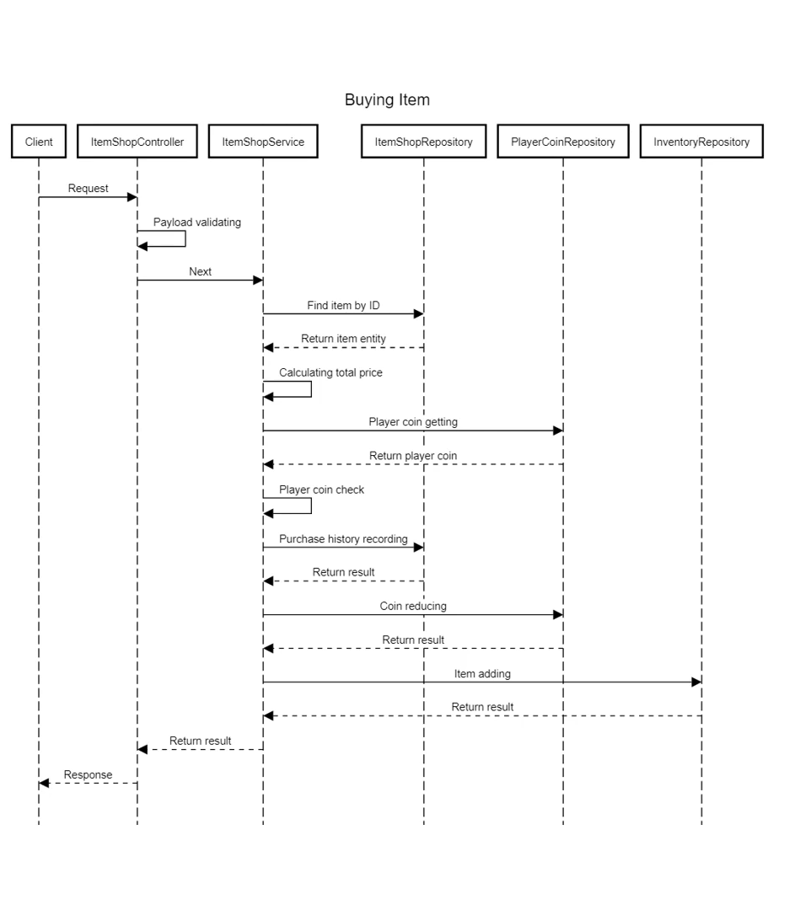

```bash
server:
  port: 8080
  allowOrigins:
    - "*"
  bodyLimit: "10M" # MiB
  timeout: 30 # Seconds
 
oauth2:
  customerRedirectUrl: "http://localhost:8080/v1/oauth2/google/customer/login/callback"
  adminRedirectUrl: "http://localhost:8080/v1/oauth2/google/admin/login/callback"
  clientId: "-"
  clientSecret: "-"
  endpoints:
    authUrl: "https://accounts.google.com/o/oauth2/auth?access_type=offline&approval_prompt=force"
    tokenUrl: "https://oauth2.googleapis.com/token"
    deviceAuthUrl: "https://oauth2.googleapis.com/device/code"
  scopes:
    - "https://www.googleapis.com/auth/userinfo.email"
    - "https://www.googleapis.com/auth/userinfo.profile"
  userInfoUrl: "https://www.googleapis.com/oauth2/v2/userinfo"
  revokeUrl: "https://accounts.google.com/o/oauth2/revoke"
  
database:
  host: localhost
  port: 5432
  user: ak
  password: 12345678
  dbname: shopdb
  sslmode: disable
  schema: public
```
